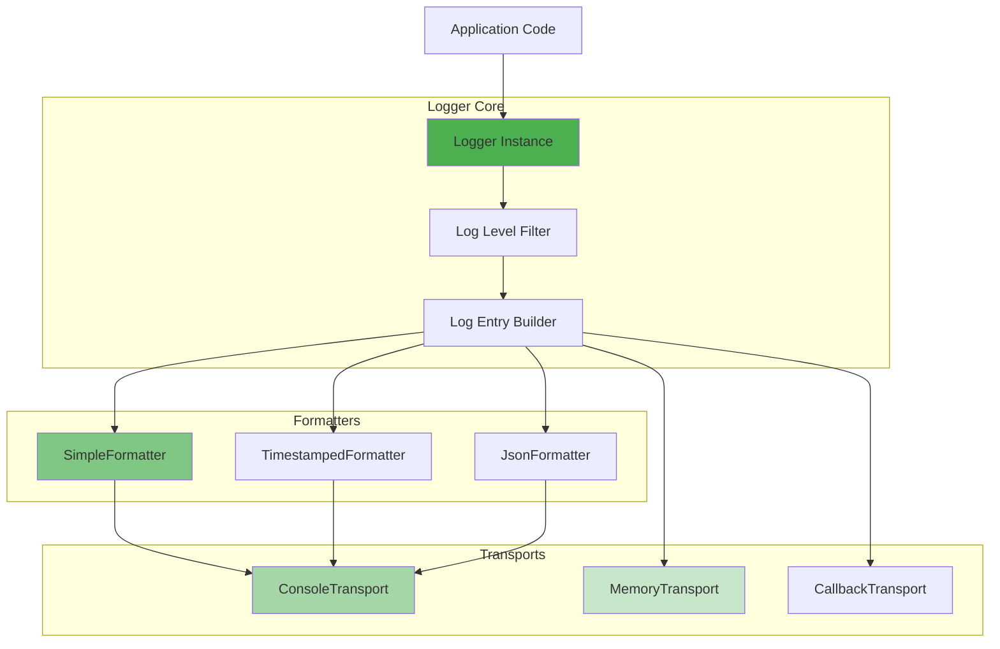

# @mark1russell7/logger

[](https://www.npmjs.com/package/@mark1russell7/logger)
[](https://opensource.org/licenses/MIT)

> Standalone logger with configurable transports and formatters

## Overview

`@mark1russell7/logger` is a lightweight, zero-dependency logging library for TypeScript/JavaScript applications. It provides structured logging with configurable output formats, multiple transports, and contextual logging capabilities.

### Key Features

- **Zero Dependencies**: No external dependencies - pure TypeScript
- **Multiple Transports**: Console, memory, callback, and custom transports
- **Flexible Formatting**: Simple, timestamped, and JSON formatters
- **Contextual Logging**: Create child loggers with nested contexts
- **Type-Safe**: Full TypeScript support with comprehensive types
- **Async Support**: Async transport operations with flush and close
- **Level-Based Filtering**: ERROR, WARN, INFO, DEBUG, TRACE levels

## Architecture



## Installation

```bash
npm install @mark1russell7/logger
```

Or from GitHub:

```bash
npm install github:mark1russell7/logger#main
```

### Prerequisites

- Node.js >= 25.0.0
- npm >= 11.0.0

## Quick Start

```typescript
import { createLogger, LogLevel } from "@mark1russell7/logger";

const logger = createLogger({
  level: LogLevel.DEBUG,
  context: "my-app",
});

logger.info("Application started");
logger.debug("Debug information", { data: { userId: 123 } });
logger.error("Error occurred", { error: new Error("Something failed") });
```

## Log Levels


| Level | Value | Description | Use Case |
|-------|-------|-------------|----------|
| `ERROR` | 0 | Errors requiring immediate attention | Application failures, exceptions |
| `WARN` | 1 | Potential issues or warnings | Deprecated usage, recoverable errors |
| `INFO` | 2 | General informational messages | Application lifecycle events |
| `DEBUG` | 3 | Detailed debugging information | Development troubleshooting |
| `TRACE` | 4 | Fine-grained tracing | Detailed execution flow |

**Filtering Logic**: Logs at or below the configured level are output.

```typescript
// Level set to INFO
logger.setLevel(LogLevel.INFO);

logger.error("Shown");  // Level 0 <= 2
logger.warn("Shown");   // Level 1 <= 2
logger.info("Shown");   // Level 2 <= 2
logger.debug("Hidden"); // Level 3 > 2
logger.trace("Hidden"); // Level 4 > 2
```

## API Reference

### Types

#### `LogLevel`

Enumeration of log levels:

```typescript
enum LogLevel {
  ERROR = 0,
  WARN = 1,
  INFO = 2,
  DEBUG = 3,
  TRACE = 4,
}
```

#### `LogEntry`

A single log entry:

```typescript
interface LogEntry {
  level: LogLevel;
  message: string;
  timestamp: Date;
  context?: string;
  data?: Record<string, unknown>;
  error?: Error;
}
```

#### `LoggerOptions`

Options for creating a logger:

```typescript
interface LoggerOptions {
  level?: LogLevel;          // Minimum log level (default: INFO)
  context?: string;          // Default context for all logs
  transports?: Transport[];  // Array of transports (default: [ConsoleTransport])
  formatter?: Formatter;     // Default formatter (default: SimpleFormatter)
}
```

#### `LogOptions`

Options for individual log calls:

```typescript
interface LogOptions {
  context?: string;                    // Override context for this log
  data?: Record<string, unknown>;      // Structured data
  error?: Error;                       // Error object
}
```

#### `Transport`

Interface for log transports:

```typescript
interface Transport {
  name: string;
  write(entry: LogEntry): void | Promise<void>;
  flush?(): void | Promise<void>;
  close?(): void | Promise<void>;
}
```

#### `Formatter`

Interface for log formatters:

```typescript
interface Formatter {
  format(entry: LogEntry): string;
}
```

### Logger Class

#### Constructor

```typescript
const logger = new Logger(options?: LoggerOptions);
```

Or use the factory function:

```typescript
const logger = createLogger(options?: LoggerOptions);
```

#### Log Methods

```typescript
// Level-specific methods
logger.error(message: string, options?: LogOptions): void
logger.warn(message: string, options?: LogOptions): void
logger.info(message: string, options?: LogOptions): void
logger.debug(message: string, options?: LogOptions): void
logger.trace(message: string, options?: LogOptions): void

// Generic log method
logger.log(level: LogLevel, message: string, options?: LogOptions): void

// Error with exception helper
logger.errorWithException(
  message: string,
  error: Error,
  options?: Omit<LogOptions, "error">
): void
```

#### Configuration Methods

```typescript
// Set minimum log level
logger.setLevel(level: LogLevel): void

// Get current log level
logger.getLevel(): LogLevel
```

#### Child Loggers

```typescript
// Create a child logger with nested context
logger.child(context: string): Logger
```

#### Transport Management

```typescript
// Add a transport
logger.addTransport(transport: Transport): void

// Remove a transport by name
logger.removeTransport(name: string): boolean

// Flush all transports
await logger.flush(): Promise<void>

// Close all transports
await logger.close(): Promise<void>
```

### Utility Functions

#### `parseLogLevel(level: string): LogLevel | null`

Parse a log level from a string:

```typescript
import { parseLogLevel } from "@mark1russell7/logger";

const level = parseLogLevel("DEBUG");
// LogLevel.DEBUG

const invalid = parseLogLevel("invalid");
// null
```

#### Default Logger

```typescript
import { getDefaultLogger, setDefaultLogger, resetDefaultLogger } from "@mark1russell7/logger";

// Get the shared default logger instance
const logger = getDefaultLogger();

// Replace the default logger
setDefaultLogger(createLogger({ level: LogLevel.DEBUG }));

// Reset to default (recreated on next getDefaultLogger())
resetDefaultLogger();
```

## Formatters

### SimpleFormatter

Basic formatting with level and optional context:

```typescript
import { SimpleFormatter } from "@mark1russell7/logger";

const formatter = new SimpleFormatter();
// Output: [INFO] [my-app] Application started
```

**Format**: `[LEVEL] [context] message`

### TimestampedFormatter

Includes ISO timestamp:

```typescript
import { TimestampedFormatter } from "@mark1russell7/logger";

const formatter = new TimestampedFormatter();
// Output: [2024-01-15T10:30:00.000Z] [INFO] [my-app] Application started
```

**Format**: `[timestamp] [LEVEL] [context] message`

### JsonFormatter

Structured JSON output:

```typescript
import { JsonFormatter } from "@mark1russell7/logger";

const formatter = new JsonFormatter();
// Output: {"level":"INFO","message":"Application started","timestamp":"2024-01-15T10:30:00.000Z","context":"my-app"}
```

**Format**: JSON object with all fields

### Factory Functions

```typescript
import {
  createSimpleFormatter,
  createTimestampedFormatter,
  createJsonFormatter
} from "@mark1russell7/logger";

const simple = createSimpleFormatter();
const timestamped = createTimestampedFormatter();
const json = createJsonFormatter();
```

## Transports

### ConsoleTransport

Outputs to `globalThis.console`:

```typescript
import { ConsoleTransport, createConsoleTransport } from "@mark1russell7/logger";

const transport = new ConsoleTransport({
  formatter: createJsonFormatter(),
});

// Or use factory
const transport = createConsoleTransport({
  formatter: createJsonFormatter(),
});
```

**Options:**
```typescript
interface ConsoleTransportOptions {
  formatter?: Formatter;
  colors?: boolean;  // Future use
}
```

### MemoryTransport

Stores entries in memory (useful for testing):

```typescript
import { MemoryTransport, createMemoryTransport } from "@mark1russell7/logger";

const memory = new MemoryTransport();
const logger = createLogger({ transports: [memory] });

logger.info("Test message");
logger.error("Error message");

// Get all entries
const entries = memory.getEntries();
// [{ level: 2, message: "Test message", ... }, { level: 0, message: "Error message", ... }]

// Get entries by level
const errors = memory.getEntries(LogLevel.ERROR);
// [{ level: 0, message: "Error message", ... }]

// Clear entries
memory.clear();
```

**Methods:**
```typescript
class MemoryTransport implements Transport {
  readonly name = "memory";
  readonly entries: LogEntry[];

  write(entry: LogEntry): void;
  clear(): void;
  getEntries(level?: LogLevel): LogEntry[];
}
```

### CallbackTransport

Invokes a custom callback for each log entry:

```typescript
import { CallbackTransport, createCallbackTransport } from "@mark1russell7/logger";

const transport = new CallbackTransport({
  callback: (entry, formatted) => {
    // Send to external service
    sendToExternalService(formatted);
  },
  formatter: createJsonFormatter(),
});

// Or use factory
const transport = createCallbackTransport({
  callback: async (entry, formatted) => {
    await sendToExternalService(formatted);
  },
});
```

**Options:**
```typescript
interface CallbackTransportOptions {
  callback: (entry: LogEntry, formatted: string) => void | Promise<void>;
  formatter?: Formatter;
}
```

### Custom Transport

Create custom transports by implementing the `Transport` interface:

```typescript
import type { Transport, LogEntry } from "@mark1russell7/logger";
import { writeFileSync } from "node:fs";

const fileTransport: Transport = {
  name: "file",

  write(entry: LogEntry): void {
    const line = JSON.stringify(entry) + "\n";
    writeFileSync("app.log", line, { flag: "a" });
  },

  flush(): void {
    // Sync if buffered
  },

  close(): void {
    // Cleanup resources
  },
};

const logger = createLogger({
  transports: [fileTransport],
});
```

## Usage Examples

### Basic Logging

```typescript
import { createLogger, LogLevel } from "@mark1russell7/logger";

const logger = createLogger({
  level: LogLevel.INFO,
  context: "my-app",
});

logger.info("Application started");
logger.debug("This won't show (level too high)");
logger.error("Fatal error occurred");
```

### Structured Logging

```typescript
logger.info("User logged in", {
  data: {
    userId: 123,
    username: "john_doe",
    timestamp: Date.now(),
  },
});

// Output: [INFO] [my-app] User logged in {"userId":123,"username":"john_doe","timestamp":1705315800000}
```

### Error Logging

```typescript
try {
  throw new Error("Something went wrong");
} catch (error) {
  logger.error("Operation failed", {
    error: error as Error,
    data: { operation: "processData" },
  });
}

// Output includes stack trace:
// [ERROR] [my-app] Operation failed {"operation":"processData"}
// Error: Something went wrong
//     at ...stack trace...
```

### Child Loggers

```typescript
const appLogger = createLogger({ context: "app" });
const dbLogger = appLogger.child("database");
const queryLogger = dbLogger.child("query");

appLogger.info("Starting");      // context: "app"
dbLogger.info("Connected");      // context: "app:database"
queryLogger.info("Executing");   // context: "app:database:query"
```

### Multiple Transports

```typescript
import {
  createLogger,
  createConsoleTransport,
  createMemoryTransport,
  createCallbackTransport,
  createJsonFormatter,
} from "@mark1russell7/logger";

const memory = createMemoryTransport();
const console = createConsoleTransport();
const webhook = createCallbackTransport({
  callback: async (entry) => {
    if (entry.level === LogLevel.ERROR) {
      await sendAlertWebhook(entry);
    }
  },
});

const logger = createLogger({
  transports: [console, memory, webhook],
  formatter: createJsonFormatter(),
});

logger.error("Critical error");
// Outputs to console, stores in memory, and sends webhook
```

### Dynamic Level Adjustment

```typescript
const logger = createLogger({ level: LogLevel.INFO });

logger.debug("Not shown");

// Change level at runtime
logger.setLevel(LogLevel.DEBUG);

logger.debug("Now shown");
```

### Testing with MemoryTransport

```typescript
import { describe, it, expect } from "vitest";
import { createLogger, createMemoryTransport, LogLevel } from "@mark1russell7/logger";

describe("MyService", () => {
  it("logs errors correctly", () => {
    const memory = createMemoryTransport();
    const logger = createLogger({ transports: [memory] });

    const service = new MyService(logger);
    service.processData();

    const errors = memory.getEntries(LogLevel.ERROR);
    expect(errors).toHaveLength(1);
    expect(errors[0]?.message).toBe("Processing failed");
  });
});
```

### JSON Logging for Production

```typescript
import { createLogger, createJsonFormatter, LogLevel } from "@mark1russell7/logger";

const logger = createLogger({
  level: process.env.LOG_LEVEL
    ? parseLogLevel(process.env.LOG_LEVEL) ?? LogLevel.INFO
    : LogLevel.INFO,
  formatter: createJsonFormatter(),
  context: process.env.SERVICE_NAME ?? "app",
});

logger.info("Server starting", {
  data: {
    port: 3000,
    env: process.env.NODE_ENV,
  },
});

// Output: {"level":"INFO","message":"Server starting","timestamp":"2024-01-15T10:30:00.000Z","context":"app","data":{"port":3000,"env":"production"}}
```

## Integration with Ecosystem

The logger is used throughout the `@mark1russell7` ecosystem:

### Client Packages

```typescript
// In @mark1russell7/client-*
import { getDefaultLogger } from "@mark1russell7/logger";

const logger = getDefaultLogger().child("client-lib");

export async function processCommand(input) {
  logger.debug("Processing command", { data: { input } });
  // ...
}
```

### CLI

```typescript
// In @mark1russell7/cli
import { createLogger, LogLevel } from "@mark1russell7/logger";

const logger = createLogger({
  level: verbose ? LogLevel.DEBUG : LogLevel.INFO,
  context: "cli",
});

logger.info("Discovering procedures...");
```

### Procedure Logging

```typescript
import { defineProcedure } from "@mark1russell7/client";
import { getDefaultLogger } from "@mark1russell7/logger";

const myProcedure = defineProcedure({
  path: ["my", "procedure"],
  handler: async (input, ctx) => {
    const logger = getDefaultLogger().child("my.procedure");
    logger.info("Executing procedure", { data: { input } });

    try {
      const result = await doWork(input);
      logger.info("Procedure completed successfully");
      return result;
    } catch (error) {
      logger.error("Procedure failed", { error: error as Error });
      throw error;
    }
  },
});
```

## Development

### Building

```bash
npm run build
```

### Testing

```bash
npm test
npm run test:watch
npm run test:coverage
```

### Project Structure

```
logger/
├── src/
│   ├── index.ts         # Main exports
│   ├── logger.ts        # Logger class
│   ├── types.ts         # Type definitions
│   ├── formatters.ts    # Formatter implementations
│   ├── transports.ts    # Transport implementations
│   └── __tests__/       # Test files
│       ├── logger.test.ts
│       ├── formatters.test.ts
│       └── types.test.ts
├── dist/                # Compiled output
└── package.json
```

## Best Practices

### Use Appropriate Log Levels

```typescript
// ERROR - Requires immediate attention
logger.error("Database connection lost", { error });

// WARN - Potential issue
logger.warn("API rate limit approaching", { data: { remaining: 10 } });

// INFO - Important events
logger.info("User authenticated", { data: { userId } });

// DEBUG - Development information
logger.debug("Cache hit", { data: { key, ttl } });

// TRACE - Very detailed tracing
logger.trace("Function entered", { data: { args } });
```

### Use Contextual Loggers

```typescript
// Create service-specific loggers
class UserService {
  private logger = getDefaultLogger().child("UserService");

  async createUser(data) {
    this.logger.info("Creating user", { data });
    // ...
  }
}
```

### Include Structured Data

```typescript
// Good - structured data
logger.info("Order processed", {
  data: {
    orderId: 12345,
    userId: 789,
    amount: 99.99,
  },
});

// Avoid - string concatenation
logger.info(`Order 12345 processed for user 789 with amount 99.99`);
```

### Handle Async Transports

```typescript
// Flush before exit
process.on("beforeExit", async () => {
  await logger.flush();
  await logger.close();
});
```

## Performance Considerations

- **Level Filtering**: Logs above the configured level are filtered early and incur minimal overhead
- **Lazy Evaluation**: Consider lazy data building for expensive operations:

```typescript
// Only builds data if DEBUG level is enabled
if (logger.getLevel() >= LogLevel.DEBUG) {
  logger.debug("Expensive data", {
    data: buildExpensiveDebugData(),
  });
}
```

- **Transport Batching**: For high-volume logging, consider implementing a batching transport

## Troubleshooting

### Logs Not Appearing

**Issue**: Logs at certain levels don't appear

**Solution**: Check the log level setting:

```typescript
logger.setLevel(LogLevel.DEBUG); // Show DEBUG and below
```

### Memory Leaks with MemoryTransport

**Issue**: Memory grows unbounded

**Solution**: Periodically clear entries or implement size limits:

```typescript
const memory = createMemoryTransport();

setInterval(() => {
  const entries = memory.getEntries();
  if (entries.length > 1000) {
    memory.clear();
  }
}, 60000);
```

### TypeScript Type Errors

**Issue**: Types not found

**Solution**: Ensure TypeScript configuration includes:

```json
{
  "compilerOptions": {
    "moduleResolution": "node",
    "esModuleInterop": true
  }
}
```

## License

MIT

## Repository

https://github.com/mark1russell7/logger

## Author

Mark Russell <marktheprogrammer17@gmail.com>
